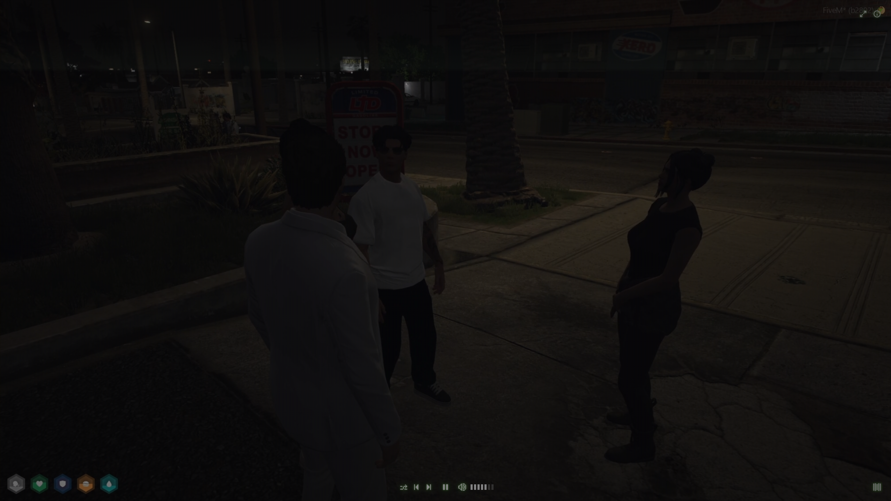
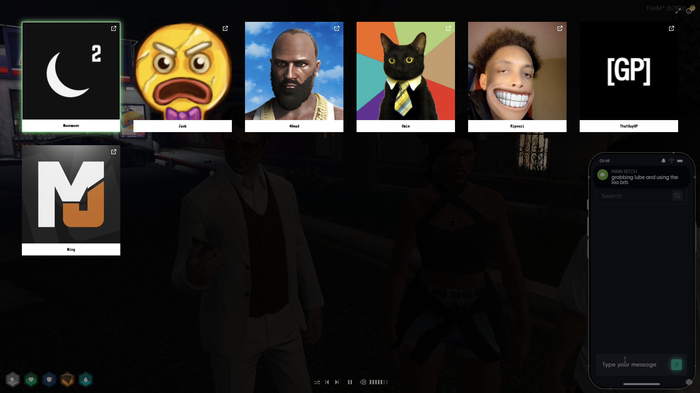

<!-- PROJECT LOGO -->
 

  <h3 align="center">
    <a href="https://lofi-nopixel.com">LOFI NoPixel</a>
  </h3>

<!-- ABOUT THE PROJECT -->

## About The Project

Lofi NoPixel is like your cozy corner on the web to chill with while watching your favorite streamers. No chat, No spam. 🎶✨

### Built With

-   ![svelte.dev]
-   ![tailwind]

## Features

-   [x] 🔋 Energy saving mode
-   [x] 📼 Retro CRT feeling

If you have any ideas for new features, feel free to open an issue and let me know!

## Acknowledgments

This project is a fork of:

-   [lofi.flow](https://github.com/Nico-Mayer/lofi-flow)

This project is heavily inspired by the following Projects:

-   [lofi.cafe](https://lofi.cafe/)
-   [lofimusic.app](https://lofimusic.app/)
-   [lofifm](https://lofifm.vercel.app/)

Inspiration for CRT effect:

-   [CRT effect](https://aleclownes.com/2017/02/01/crt-display.html)

[svelte.dev]: https://img.shields.io/badge/Svelte-4A4A55?style=for-the-badge&logo=svelte&logoColor=FF3E00
[tailwind]: https://img.shields.io/badge/Tailwind-38B2AC?style=for-the-badge&logo=tailwind-css&logoColor=white
