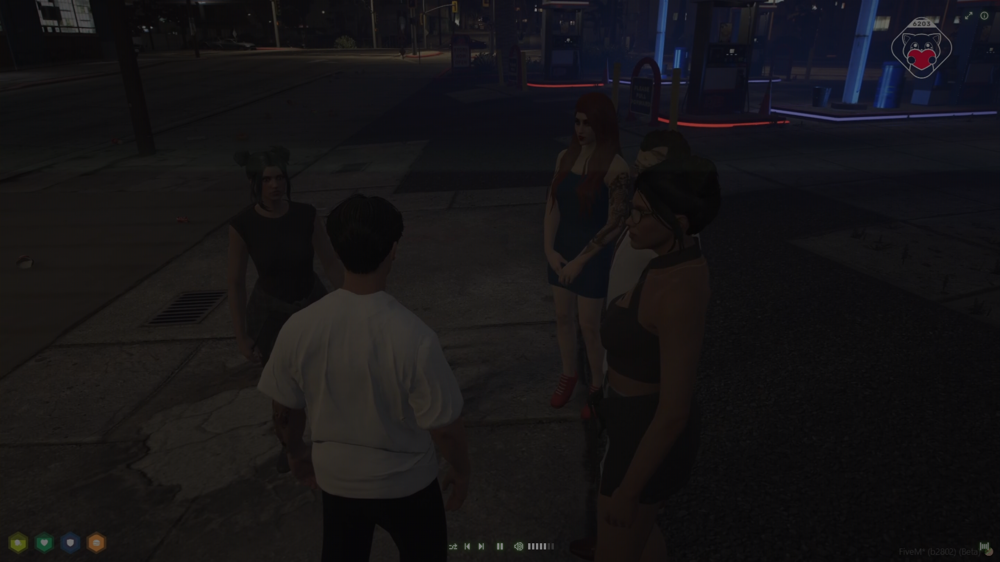

<!-- PROJECT LOGO -->
 

  

  <h3 align="center">
    <a href="https://lofi-flow.vercel.app">LOFI Flow</a>
  </h3>

<!-- ABOUT THE PROJECT -->

## About The Project

Lofi Flow is like your cozy corner on the web for all things chill. Save your best-loved YouTube lofi live radios and videos in one spot, kick back with the laid-back vibes of Lofi Flow, and let it be the soundtrack to your relaxation or background beats while you're doing your thing. 🎶✨

### Built With

- ![svelte.dev]
- ![tailwind]

## Features

- [x] 📺 Save your favorite YouTube lofi live radios and videos
- [x] 🔋 Energy saving mode
- [x] 📼 Retro CRT feeling

If you have any ideas for new features, feel free to open an issue and let me know!

## Acknowledgments

This project is heavily inspired by the following Projects:

- [lofi.cafe](https://lofi.cafe/)
- [lofimusic.app](https://lofimusic.app/)
- [lofifm](https://lofifm.vercel.app/)

Inspiration for CRT effect:

- [CRT effect](https://aleclownes.com/2017/02/01/crt-display.html)

[svelte.dev]: https://img.shields.io/badge/Svelte-4A4A55?style=for-the-badge&logo=svelte&logoColor=FF3E00
[tailwind]: https://img.shields.io/badge/Tailwind-38B2AC?style=for-the-badge&logo=tailwind-css&logoColor=white

## Todo's

- [ ] add fullscreen support
- [ ] improve chanel list ui (add video, closing behavior)
- [ ] invest in initial load bug
- [x] invest in redirect bug
- [ ] improve local storage parsing error handling
- [ ] impl low power mode
- [ ] add vercel analytics
